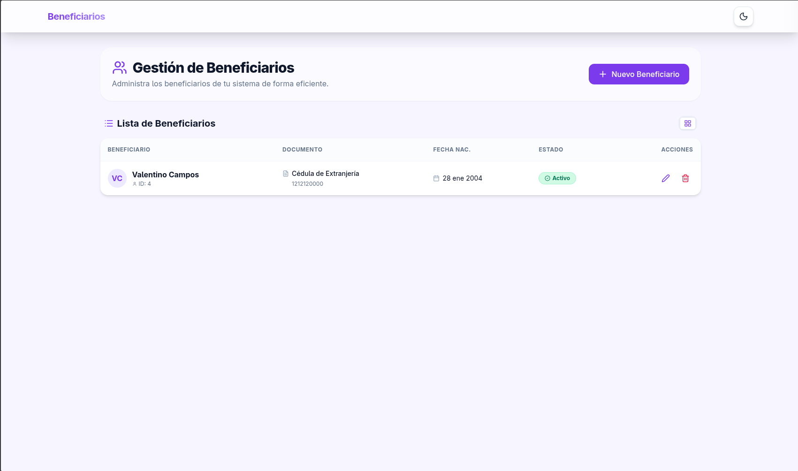
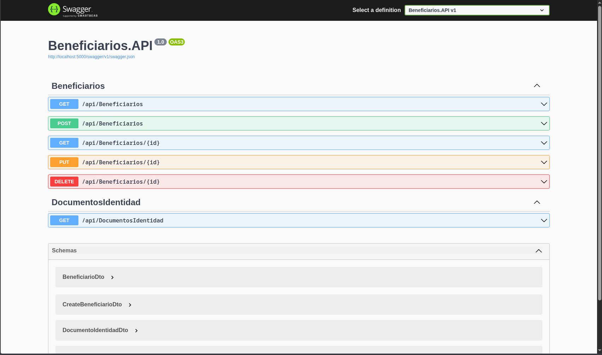

# Sistema CRUD de Beneficiarios

Resolución de caso propuesto.

## 📚 Documentación

- [**Análisis**](docs/00-analisis.md) - Descripción general del analisis para este caso
- [**Arquitectura**](docs/02-arquitectura.md) - Análisis técnico profundo
- [**API Details**](docs/03-api.md) - Endpoints y validaciones
- [**Pruebas API**](docs/04-pruebas-api.http) - Tests cliente REST
- [**Guía Docker**](docs/06-guia-docker.md) - Configuración Docker completa
- [**Windows Setup**](docs/07-configurar-db.md) - Configuración específica Windows

## 🚀 Inicio Rápido

1. Iniciar docker compose para levantar los servicios.

[Comando Docker Compose](./docs/screenshots/compose.png)
```bash
docker compose up --build

# Acceder a la aplicación
# Frontend: http://localhost:3000
# API Backend: http://localhost:5000
# Documentación Swagger: http://localhost:5000/swagger
```
2. Configurar la base de datos si se usa **Docker**:

>
> - En **Linux/MacOS** usa el script en `./scripts-init-database/init-database.sh`: [Ejecución Script Base de Datos](./docs/screenshots/run-script-db.png)

> - En **Windows** sigue la guía: [**Configuración de Base de Datos**](./docs/07-configurar-db.md)

# Una vez iniciado, deberías ver:

### Frontend Application

*Interfaz de React ejecutándose en localhost:3000*

### Backend API

*API REST con Swagger documentation en localhost:5000*

## Stack

### Backend
- **.NET 8 Web API** - Framework web moderno
- **SQL Server** - Base de datos relacional
- **Stored Procedures** - Acceso optimizado a datos
- **Clean Architecture** - Patrón de diseño escalable

### Frontend
- **React 18 + TypeScript** - Desarrollo UI con tipado seguro
- **TailwindCSS** - Estilos utilitarios primero
- **Vite** - Herramienta de construcción rápida
- **React Hook Form** - Gestión eficiente de formularios

## Estructura del Proyecto

```
tt-pma-crud/
├── backend/                    # API .NET con Clean Architecture
│   ├── Beneficiarios.API/      # Controladores y configuración
│   ├── Beneficiarios.Application/  # Lógica de negocio
│   ├── Beneficiarios.Domain/   # Entidades del dominio
│   └── Beneficiarios.Infrastructure/  # Acceso a datos
├── frontend/                   # Aplicación React
│   ├── src/components/         # Componentes UI
│   ├── src/pages/              # Páginas principales
│   ├── src/hooks/              # Hooks personalizados
│   └── src/services/           # Servicios API
├── docs/                       # Documentación completa
└── compose.yml                  # Orquestación de servicios
```

## 📈 Preparado para Escalabilidad

Arquitectura preparada para:

- **Microservicios**: Separación basada en dominio
- **Serverless**: Migración a Azure Functions
- **Caching**: Integración Redis para alto volumen

##  Pruebas de API
Usar el archivo `docs/04-pruebas-api.http` con VS Code REST Client:

## Desarrollo Local

### Prerrequisitos
- Docker & Docker Compose
- .NET 8 SDK (para desarrollo local)
- Node.js 18+ (para desarrollo local)

### Backend (sin Docker)
```bash
cd backend
dotnet restore
dotnet run --project Beneficiarios.API
```

### Frontend (sin Docker)
```bash
cd frontend
npm install
npm run dev
```

## 📋 Endpoints Principales

### Tipos de Documento
- `GET /api/documentos-identidad` - Obtener tipos de documento activos

### Beneficiarios
- `GET /api/beneficiarios` - Listar todos los beneficiarios
- `GET /api/beneficiarios/{id}` - Obtener beneficiario por ID
- `POST /api/beneficiarios` - Crear nuevo beneficiario
- `PUT /api/beneficiarios/{id}` - Actualizar beneficiario
- `DELETE /api/beneficiarios/{id}` - Eliminar beneficiario (soft delete)
