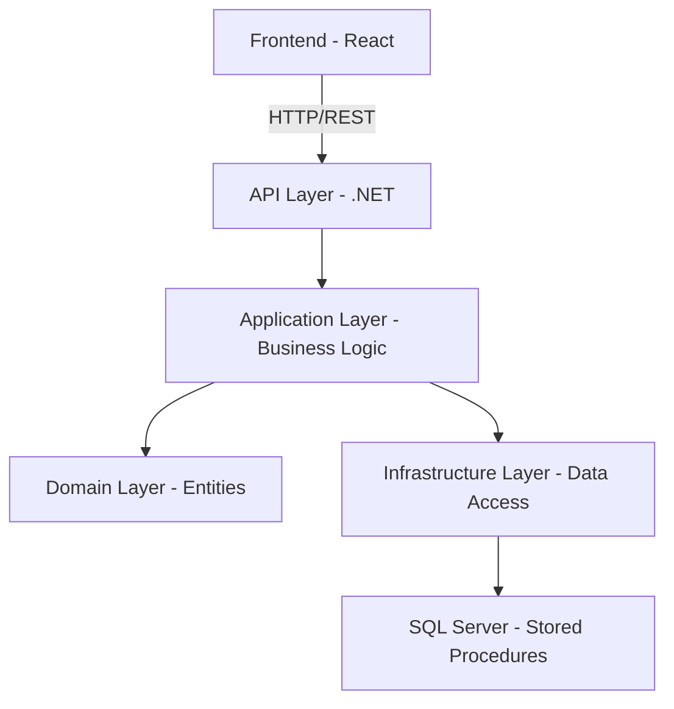

# Arquitectura del Sistema

#### ¿Por qué esta arquitectura?
Elegí una Clean Architecture simplificada porque prioriza la separación de responsabilidades, el código limpio y las buenas prácticas, sin añadir complejidad innecesaria para el alcance actual del proyecto.

Inicialmente consideré una arquitectura modular, ya que facilita ver la separación por funcionalidades de forma muy clara. Sin embargo, opté por Clean Architecture por su filosofía, que promueve dependencias hacia el dominio y no hacia frameworks o tecnologías específicas, haciendo el sistema más mantenible y escalable.

## Diagrama de Arquitectura

## Escalabilidad Futura

### Microservicios Listos
La arquitectura actual permite evolucionar a:

- **Beneficiarios.API**: Gestión completa de beneficiarios
- **Documentos.API**: Tipos y validaciones de documento
- **Validación.API**: Servicio centralizado de validaciones

### Serverless Ready
- **Azure Functions o Lambdas**: Cada controller puede convertirse en function
- **Triggers**: HTTP, Timer, Queue para diferentes casos de uso
- **Stateless**: Diseño actual compatible con serverless

---

---

## 📖 Navegación

| ← Anterior | Index | Siguiente → |
|------------|--------|-------------|
| [🎯 Análisis](00-analisis.md) | [📋 Índice Docs](README.md) | [🔌 API Details](03-api.md) |

