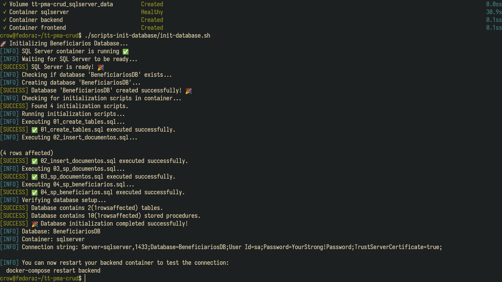
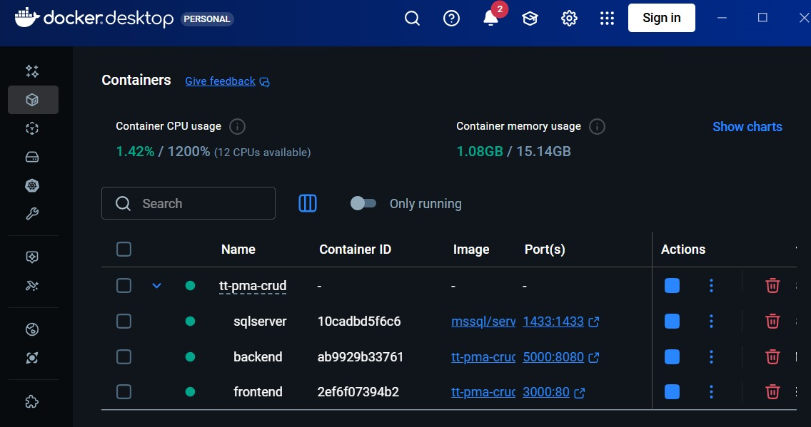
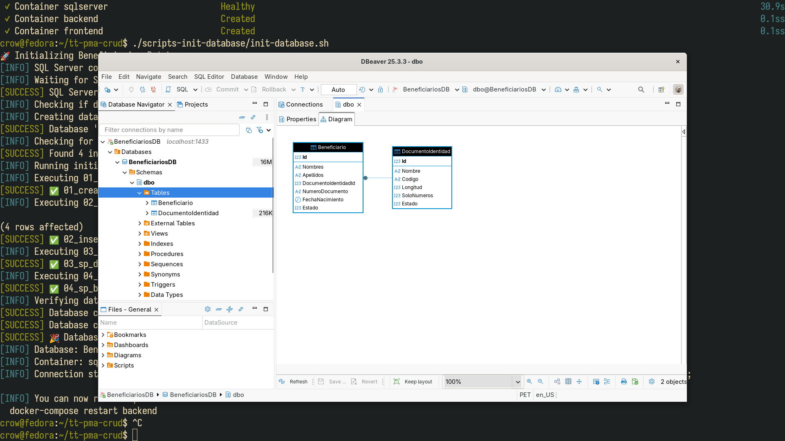
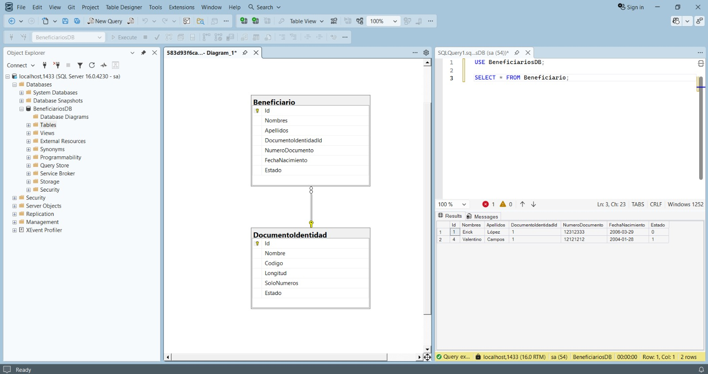

# Guía de Configuración para Windows

# Linux/MacOS

Run:
```bash
$ ./scripts-init-database/init-database.sh
```



# Windows

###  Requisitos Previos


*Asegúrate de que Docker Desktop esté ejecutándose correctamente*

## ⚙️ Configuración Manual 

### Paso 1: Iniciar SQL Server
```powershell
docker compose up sqlserver -d
```

### Paso 2: Ejecutar Scripts de Configuración de Base de Datos
```powershell
# Esperar 30 segundos a que inicie SQL Server, luego ejecutar:
docker exec sqlserver /opt/mssql-tools18/bin/sqlcmd -S localhost -U sa -P "YourStrong!Password" -C -d "BeneficiariosDB" -i "/docker-entrypoint-initdb.d/01_create_tables.sql" -i "/docker-entrypoint-initdb.d/02_insert_documentos.sql" -i "/docker-entrypoint-initdb.d/03_sp_documentos.sql" -i "/docker-entrypoint-initdb.d/04_sp_beneficiarios.sql"
```

### Paso 3: Iniciar Todos los Servicios
```powershell
docker compose up --build
```

## 🔧 Herramientas de Base de Datos

### Opción 1: DBeaver (Recomendado)


*DBeaver proporciona una interfaz intuitiva para gestión de base de datos*

### Opción 2: SQL Server Management Studio


*SSMS es la herramienta oficial de Microsoft para SQL Server*
